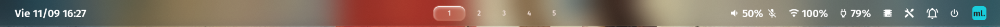
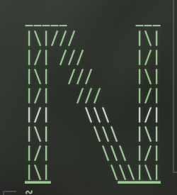

# hyprland-dotfiles

Personalización minimalista y "tecno" para [ML4W Dotfiles](https://github.com/mylinuxforwork/dotfiles)
sobre **Hyprland**, pensada para contrastar con fondos de **pinturas históricas y antiguas**:
la interfaz se vuelve translúcida, plana y de líneas finas para que el cuadro sea el protagonista.





## Qué incluye

| Componente | Cambio |
|---|---|
| **Barra superior** (Waybar, tema `ml4w-transparent-centered`) | Pegada al borde, plana, translúcida (12%) con blur, línea inferior fina, 34 px de alto. El logo de ML4W se reemplaza por la marca `N.M.` en JetBrainsMono. |
| **Fecha** | `Vie 11/09 16:27` a la izquierda, con el día en español (`Lun Mar Mie Jue Vie Sab Dom`) sin depender de locales instalados. Clic abre el calendario. |
| **Íconos de la barra** | Glifos Material Design de contorno de **JetBrainsMono Nerd Font** (volumen, wifi, batería, campana, etc.). Sin quicklinks. |
| **Micrófono** | Ícono de micrófono tachado en la barra cuando está muteado. |
| **LED de la tecla de micrófono** | Se apaga cuando el micrófono está muteado (sincronizado con PipeWire, sin root). |
| **Dock** (nwg-dock-hyprland) | Tema `custom`: translúcido, esquinas rectas, borde fino, flotante, con blur. |
| **Notificaciones** (swaync) | Tema `custom`: translúcidas (5%), esquinas rectas, blur que muestra lo que hay detrás (sin xray). |
| **Cursor** | No salta al centro de la ventana al enfocarla (`cursor:no_warps`). |
| **Pantalla de bloqueo** (hyprlock) | Borde de la foto, hora, usuario y campo de contraseña en crema `#e6dfcf` translúcido. |
| **Terminal** (kitty) | Tipografía chica (7), más aire alrededor del texto (18) y cursor en barra fina. |
| **Prompt** (oh-my-posh) | Dos líneas con marco fino: `┌─ ruta ── rama` y `└─›`, con la flecha en rojo si el comando falló. |
| **Bienvenida** (fastfetch) | Especificaciones pegadas a la izquierda, el bloque animado `N ▪ M ▪` centrado y una bandera argentina flameando a la derecha. |
| **Wallpaper** | Una pintura al azar en cada arranque, aplicada por ML4W (sin carreras ni `sleep`). |
| **Escala del panel** | El monitor interno al 100%: usa la resolución real en vez de escalar al 150%. |
| **Lanzador** (rofi) | Compacto, translúcido con blur y en JetBrainsMono, sin íconos de colores. Un solo atajo para todo. |

### El bloque animado de la consola

Al abrir la terminal, fastfetch imprime las especificaciones a la izquierda (sin logo) y
`config/fastfetch/centrado.sh` coloca, centrado, el bloque `N ▪ M ▪` y, pegada al margen
derecho, una bandera argentina flameando. La bandera solo se dibuja si entra sin acercarse
al bloque centrado: en una terminal angosta se omite en vez de encimarse.

Las letras son de "andamio", dibujadas con `| / \ _ ▔`:

```
_____        ___          _____      _____
|/|\\\       |/|          |/|\\\    ///|/|
|\| \\\      |\|          |\| \\\  /// |\|
|/|  \\\     |/|          |/|  \\\///  |/|
|\|   \\\    |\|          |\|   \\//   |\|
|/|    \\\   |/|          |/|          |/|
|\|     \\\  |\|          |\|          |\|
|/|      \\\ |/|          |/|          |/|
|\|       \\\|\|          |\|          |\|
▔▔▔        ▔▔▔▔▔          ▔▔▔          ▔▔▔
```

Las recorren **salvas de cuatro olas** que suben de abajo hacia arriba, una detrás de otra,
separadas por una fila. Cada ola hace avanzar una fase a la fila que toca, y cada carácter
sigue el ciclo de su papel original:

```
rieles      |  ->  /  ->  -  ->  \  ->  |     (vuelta completa en 4 olas)
andamio     /  ->  \  ->  /  ->  \          (y al revés si nació \)
diagonal    \  ->  /  ->  \  ->  /
remates     _  ->  -  ->  _  ->  -          (lo mismo el ▔ de abajo)
```

Como la salva tiene cuatro olas, al terminar de pasar cada fila volvió exactamente a su lugar
y la letra queda entera. Mientras la banda viaja, el resto se mantiene legible.

Los **puntos** son aparte: un cuadrado que salta entre las cuatro esquinas (`▖ ▘ ▝ ▗`), con su
propio ritmo, así que su giro no depende del de las letras. El piso del salto queda a ras del
`▔` de la N y la M.

Todo lo genera `config/fastfetch/logo-n.py` como **APNG** en `~/.cache/fastfetch/`, y kitty los
reproduce en bucle sin bloquear el shell. Los colores salen de la paleta de matugen, así que el
bloque acompaña a la pintura de fondo.

Detalles de la colocación: solo se dibuja en kitty y solo si el bloque (45 columnas) entra
centrado sin acercarse a las especificaciones; las posiciones son absolutas en pantalla, así que
`bashrc/custom/30-autostart` engancha un `trap … WINCH` que lo vuelve a dibujar recentrado al
redimensionar la ventana o abrir una pestaña. Si ya ejecutaste comandos o scrolleaste, no se
redibuja, para no pintar sobre tu trabajo. Como cualquier imagen del terminal, desaparece con `clear`.

> El mismo script deja una versión quieta y blanca de la N en `~/.config/waybar/assets/logo-n.png`,
> por si se la quiere usar como logo de la barra. No viene activada: a 34 px de alto el andamio se
> agrisa y se pierde, así que en la barra va la marca `N.M.` como texto. El CSS tiene anotado cómo cambiarlo.

La bandera está hecha con caracteres, como el resto de la consola: caracteres de línea
para la tela (`═` en las franjas celestes, `─` en la blanca) y, para el Sol de Mayo, los
mismos trazos que arman la N y la M:

```
\|/
-O-
/|\
```

Cada columna sube y baja siguiendo una onda viajera —que es como ondula una tela— y las
crestas se dibujan más claras, lo que da volumen. Sus colores son los de la bandera y no
los toca matugen.

Mide 40x10 celdas. Como la celda de kitty es 8x19 px, en pantalla queda de 320x190,
o sea 1,68:1 — cerca del 1,56:1 de la bandera real.

### El lanzador

`rofi/config.rasi` reemplaza al de ML4W. La idea es que el lanzador hable el mismo idioma
que la barra y la consola: panel compacto de 560 px centrado, translúcido con blur, tipografía
JetBrainsMono y **sin íconos de aplicación a color**, que era lo que más desentonaba. La
selección es una fila apenas más clara, con el color de la pintura solo en el borde izquierdo
y el texto.

Los colores salen de `rofi/colors.rasi`, que reescribe matugen con cada pintura, así que el
lanzador acompaña al wallpaper igual que el resto.

El blur lo dan tres `layerrule` de `hypr/conf/custom.conf`: sin ellas, una translucidez así
deja el lanzador ilegible sobre la pintura.

Antes había **dos** lanzadores conviviendo: `Super+Espacio` abría wofi (sin tematizar, con el
aspecto GTK por defecto) y `Super+Ctrl+Enter` abría rofi. Ahora los dos abren el mismo.
`keybinding.conf` trae ese cambio. wofi no se desinstala: simplemente deja de estar asignado.

### Escala del panel

`hypr/conf/custom.conf` trae `monitor = eDP-1,preferred,auto,1`, que deja el panel interno
al 100% de escala: en un 1920x1200 se usan los 1920x1200 reales en vez de los 1280x800 que
da la escala 1.5. Entra bastante más contenido, a costa de que todo se vea más chico.

El logo de la consola no se deforma: la escala multiplica ancho y alto por igual, así que la
celda de kitty conserva su proporción, y como los PNG están dibujados al doble de resolución
con la celda más chica se ven incluso más nítidos.

Si tu panel interno no se llama `eDP-1` (miralo con `hyprctl monitors`), cambiá el nombre.
Para volver al valor por defecto, borrá esa línea.

## Requisitos

- Arch Linux (o derivada) con **Hyprland ≥ 0.53** (probado en 0.56.2; usa la sintaxis `layerrule = …, match:namespace …`).
- **ML4W Dotfiles** instalados (versión *stable*), con el tema de Waybar `ml4w-transparent-centered`.
- Paquetes: `waybar`, `swaync`, `nwg-dock-hyprland`, `hyprlock`, `kitty`, `fastfetch`,
  `oh-my-posh`, `libpulse` (`pactl`), `ttf-jetbrains-mono-nerd`, `python-pillow` (para generar las piezas).
- Para el LED de micrófono: una laptop con LED `platform::micmute` (ThinkPad y similares) y `systemd-logind` (viene por defecto).
- El bloque animado **solo funciona en kitty**.

## Instalación

```bash
git clone https://github.com/MichelNahuel/hyprland-dotfiles.git
cd hyprland-dotfiles
bash install.sh
```

`install.sh`:

1. Verifica que ML4W esté instalado.
2. Guarda un respaldo de cada archivo que va a reemplazar en `~/backups/hyprland-dotfiles-<fecha>/`
   y anota los archivos nuevos.
3. Copia los archivos de `config/` a `~/.config/` (respetando los symlinks de ML4W).
4. Ajusta las rutas de `hyprlock.conf` a tu `$HOME` y genera las piezas animadas.
5. Recarga Hyprland, Waybar, el dock, swaync, kitty e inicia el script del LED.

Todo queda aplicado de forma permanente: al encender la computadora, el autostart de ML4W
lanza Waybar, el dock y swaync con estos temas, y `hypr/conf/custom.conf` inicia el script del LED.

> Para instalar sin recargar nada (por ejemplo, desde una TTY): `NO_RELOAD=1 bash install.sh`

### Dos pasos manuales

Estos tocan archivos grandes de ML4W, así que no se incluyen en el repositorio.

**1. Pintura al azar al iniciar.** En `~/.config/hypr/conf/autostart.conf`, reemplazá

```
exec-once = ~/.config/ml4w/scripts/ml4w-autostart
```

por

```
exec-once = bash -c "~/.config/hypr/scripts/wallpaper-inicio.sh; ~/.config/ml4w/scripts/ml4w-autostart"
```

y quitá cualquier otro `exec-once` que cambie el wallpaper al iniciar. El script solo escribe la
pintura elegida en la caché de ML4W; al ir encadenado, la caché ya está lista cuando
`ml4w-autostart` la lee: sin carreras ni `sleep`. Con `Super + Shift + W` se cambia a otra pintura.

**2. Que las piezas se regeneren con cada pintura.** Agregá al final de `~/.config/matugen/config.toml`:

```toml
[templates.logo_n]
input_path = '~/.config/matugen/templates/logo-n-colores'
output_path = '~/.cache/fastfetch/logo-n-colores'
post_hook = 'python3 ~/.config/fastfetch/logo-n.py'
```

Sin este paso el bloque funciona igual, pero conserva los colores con los que se generó.

### Imágenes (no incluidas)

Por derechos de autor, el repositorio **no** incluye imágenes:

- **Pantalla de bloqueo**: `hyprlock.conf` espera
  `~/Pictures/pantalla_bloqueo/kcd_fondo.png` (fondo, 1920×1080) y
  `~/Pictures/pantalla_bloqueo/vault_boy.png` (foto de perfil). Poné tus imágenes con esos nombres
  o cambiá las rutas `path =` en `~/.config/hypr/hyprlock.conf`.
- **Wallpapers**: la estética está pensada para pinturas (por ejemplo *La Libertad guiando al pueblo*,
  de Delacroix, de dominio público). Poné las tuyas en `~/wallpapers`.

## Volver atrás

Cada instalación genera su propio script de restauración, que devuelve los archivos originales
y borra los que se agregaron:

```bash
bash ~/backups/hyprland-dotfiles-<fecha>/restaurar.sh
```

## Personalizar

| Qué | Dónde |
|---|---|
| Transparencia de la barra | `waybar/themes/ml4w-transparent-centered/default/style-custom.css` → `background: alpha(@surface_container_lowest, 0.12)` |
| Alto de la barra | mismo archivo → `#workspaces { padding }` y el tamaño de `#custom-ml4w-welcome` |
| Marca `N.M.` de la barra | `waybar/modules.json` (`custom/ml4w-welcome` → `format`) y el bloque `#custom-ml4w-welcome` del CSS |
| Formato de la fecha / días con tilde | `waybar/scripts/fecha.sh` → `'%(%w %d/%m %H:%M)T'` y la lista `dias` |
| Íconos de la barra | `waybar/modules.json` (glifos `md-*` de Nerd Fonts: <https://www.nerdfonts.com/cheat-sheet>) |
| Transparencia de notificaciones | `swaync/themes/custom/style.css` → `alpha(@surface_container_lowest, 0.05)` |
| Estilo del dock | `nwg-dock-hyprland/themes/custom/style.css` |
| Tamaño de letra de la terminal | `kitty/custom.conf` → `font_size` (al cambiarlo hay que rehacer `ANCHO_CELDA`/`ALTO_CELDA` en `logo-n.py`: son el doble de la celda; medidas: 7→8x19, 8→10x22, 9→11x24, 10→12x27) |
| Prompt | `ohmyposh/marco.toml` |
| Datos de la bienvenida | `fastfetch/config.jsonc` |
| Velocidad y tamaño de las letras | `fastfetch/logo-n.py` → `MS_PASO` (paso de la ola), `MS_CIERRE` (pausa con la letra entera), `COLS`, `FILAS` |
| Giro y tamaño del punto | `fastfetch/logo-n.py` → `CICLO_PUNTO`, `PUNTO_MS`, `PUNTO_LADO` y `PIE_PUNTO` (margen al pie que alinea el piso del salto) |
| Posición y separación del bloque | `fastfetch/centrado.sh` → `PUNTO_COLS`, `PUNTO_FILAS`, `HUECO`, `FILA_LETRAS` |
| Tamaño de la bandera | `fastfetch/logo-n.py` → `BANDERA_COLS`, `BANDERA_FILAS` (y el mismo `BANDERA_COLS` en `centrado.sh`) |
| Ondulación y sol de la bandera | `fastfetch/logo-n.py` → `BANDERA_AMP` (amplitud), `BANDERA_LARGO` (largo de onda **en celdas**: al ensanchar la bandera aparecen más ondas en vez de estirarse), `BANDERA_MS`, `SOL_ARTE`, `TELA_CELESTE` / `TELA_BLANCA` |
| Posición de la bandera | `fastfetch/centrado.sh` → `BANDERA_COLS`, `BANDERA_FILAS`, `MARGEN_DER`, `AIRE` |
| LED encendido al mutear (al revés) | `hypr/scripts/mic-led.sh` → intercambiar `valor=0` / `valor=1` |
| Colores de la pantalla de bloqueo | `hypr/hyprlock.conf` → `rgba(e6dfcf..)` |

Después de editar: `Super + Shift + B` recarga Waybar, `swaync-client -rs` recarga las notificaciones,
`hyprctl reload` recarga Hyprland y `pkill -USR1 -x kitty` recarga la terminal.

## Notas

- Si actualizás ML4W Dotfiles, algunos archivos (`waybar/modules.json`, el `config` del tema de Waybar,
  `hyprlock.conf`, `fastfetch/config.jsonc`) pueden volver a los originales: volvé a ejecutar `bash install.sh`.
- Si cambiás el estilo de decoración desde la app de ML4W, copiá las líneas de `nwg-dock` de
  `hypr/conf/decorations/rounding-all-blur-no-shadows.conf` al nuevo archivo para mantener el blur del dock.
- Si cambiás el tema de Waybar con el selector de ML4W, la barra deja de usar esta configuración.
- El prompt y la bienvenida se cargan desde `~/.config/bashrc/custom/`, el mecanismo que ML4W
  reserva para reemplazar sus propios archivos.

## Licencia

**GPL-3.0.** El texto completo está en [LICENSE](LICENSE).

Podés usar, modificar y redistribuir esta configuración libremente. La única condición es que,
si distribuís una versión modificada, la publiques bajo la misma licencia y con el código
disponible.

Es la licencia que corresponde: este repositorio contiene archivos derivados de ML4W Dotfiles,
que es GPL-3.0, y la GPL es copyleft — los trabajos derivados mantienen la licencia.

## Créditos

Basado en [ML4W Dotfiles](https://github.com/mylinuxforwork/dotfiles) de Stephan Raabe (GPL-3.0).
Los archivos de `config/` derivados de ML4W mantienen esa licencia.
